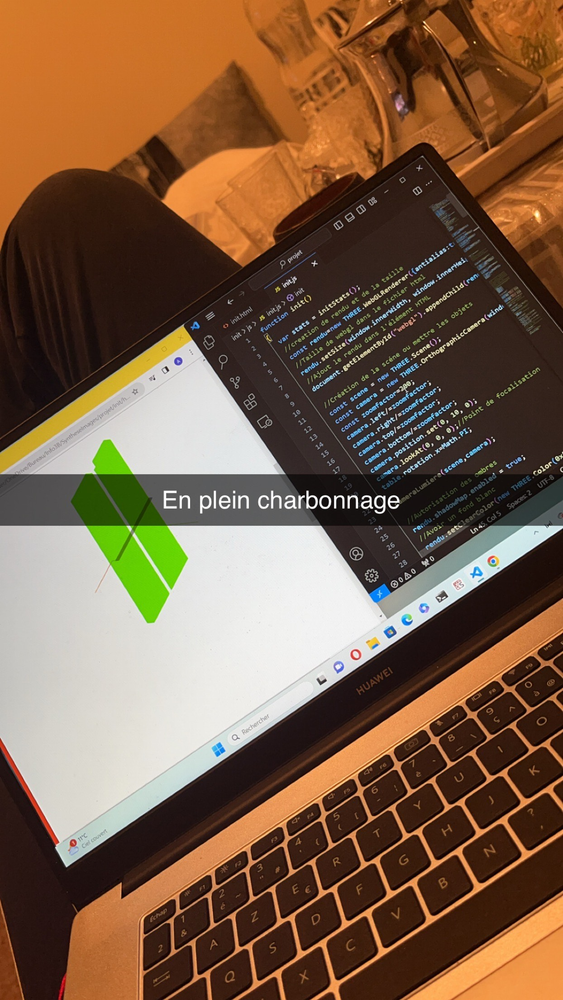

# Jeu de Ping-Pong - Courbes de Bézier

Jeu de tennis de table développé en HTML/CSS/JavaScript pur, utilisant des courbes de Bézier pour créer les éléments graphiques.

## Caractéristiques

Tous les éléments visuels sont créés à la main avec des courbes de Bézier :
- Table de tennis de table
- Filet
- Sol
- Balle avec animations fluides

## Technologies

- HTML5
- CSS3
- JavaScript 
- Canvas API
- Courbes de Bézier pour le rendu graphique

## Démonstration

## Approche technique

Projet réalisé sans framework ni bibliothèque externe, mettant l'accent sur :
- Manipulation du Canvas
- Calculs mathématiques pour les courbes de Bézier
- Animation fluide en JavaScript pur
- Design graphique procédural

## 👨‍💻 Développeur

Abderrahmane RAJILLAH
